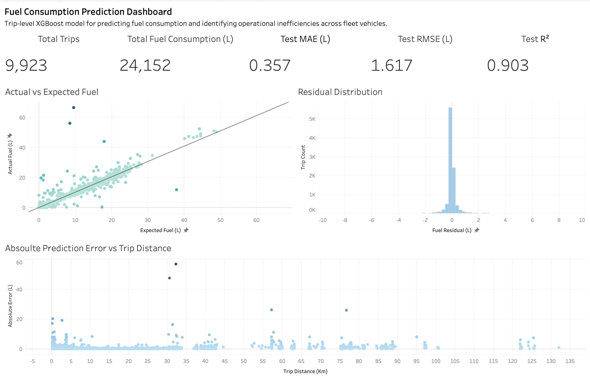
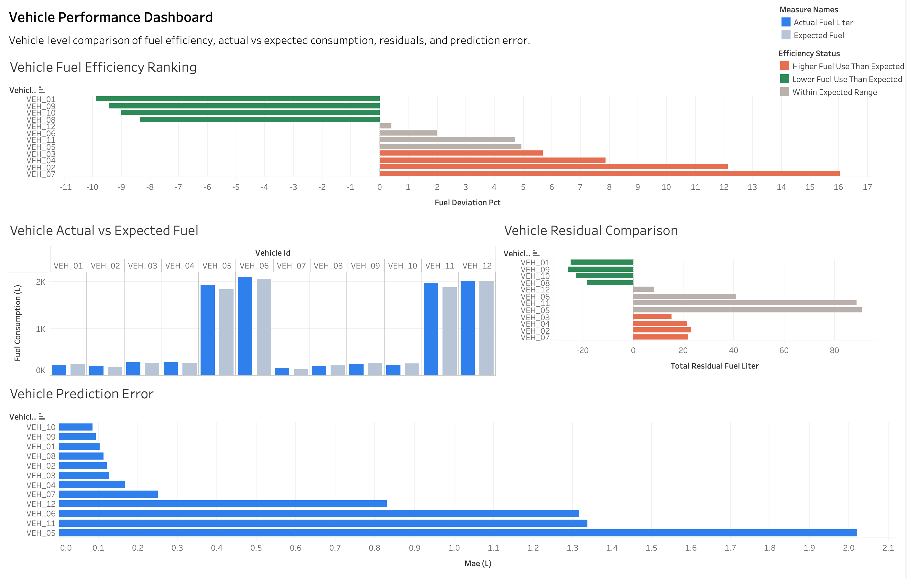
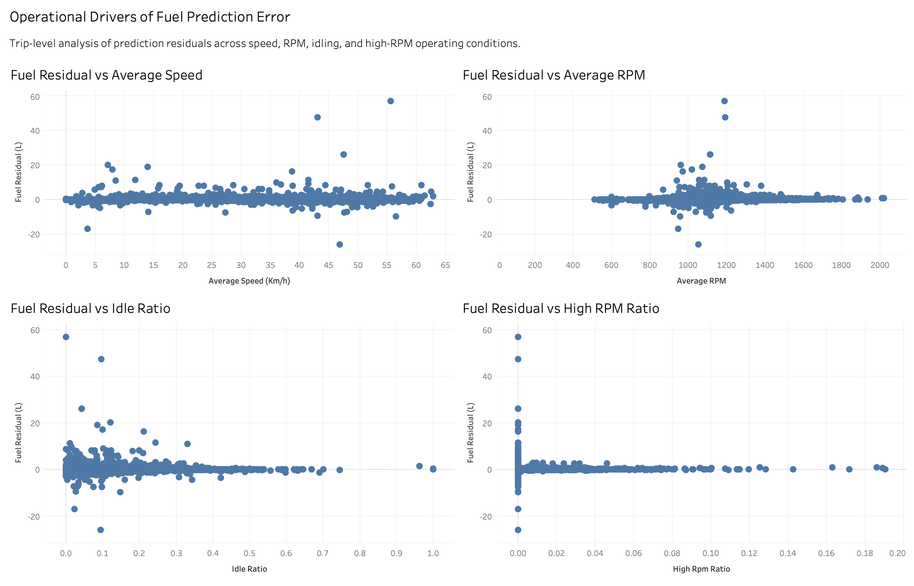
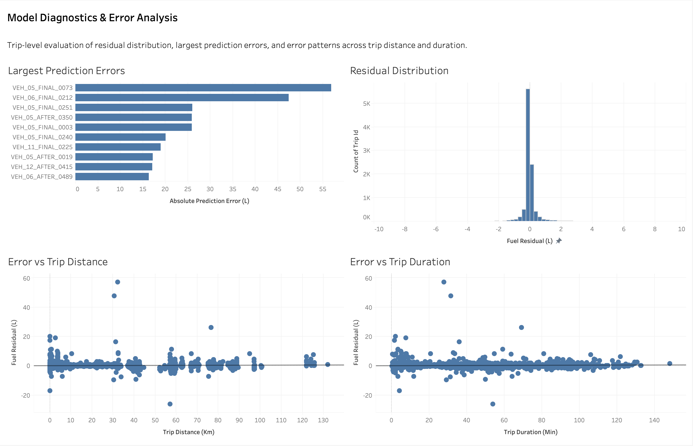

# Fuel Consumption Prediction & Fleet Efficiency Analysis

> Machine learning system for predicting expected fuel consumption and identifying vehicle-level operational inefficiencies across a commercial fleet.

## Project Overview

This project develops a machine learning framework to estimate **expected fuel consumption at the trip level** and use those predictions to evaluate fuel-efficiency performance across a commercial vehicle fleet.

Real-world telematics data from **12 vehicles** was transformed into a trip-level modeling dataset containing operational features such as trip distance, duration, speed, engine RPM, idling behavior, and temperature. Multiple regression approaches were evaluated, with **XGBoost** selected as the final model.

The final model achieved **R² = 0.903, MAE = 0.357 L, and RMSE = 1.617 L** on out-of-sample trips.

Rather than using prediction accuracy as the final output, the model serves as an **expected-fuel baseline**. Actual fuel consumption is compared against model-predicted consumption to identify vehicles and operating conditions associated with unusually high or low fuel usage.

**Project Highlights**
- 12-vehicle commercial fleet
- 9,923 out-of-sample trips evaluated
- XGBoost expected-fuel prediction model
- Test R²: **0.903**
- Test MAE: **0.357 L**
- Vehicle-level efficiency ranking using Actual vs. Expected fuel
- Operational and residual analysis through an interactive Tableau dashboard

## Business Problem

Raw fuel consumption alone is not sufficient to determine whether a vehicle is operating efficiently. A vehicle traveling longer distances, operating at higher speeds, or spending more time idling will naturally consume more fuel than another vehicle.

This makes direct fuel-consumption comparisons across vehicles potentially misleading.

The key business question is therefore:

> **How much fuel should a vehicle have consumed given the conditions under which it operated?**

To address this problem, the project builds an expected-fuel baseline that accounts for trip-level operating conditions. The difference between actual and expected fuel consumption is then used to:

- identify vehicles consistently consuming more fuel than expected,
- distinguish operational inefficiency from differences in trip conditions,
- investigate driving and operating factors associated with prediction residuals, and
- provide a quantitative framework for fleet-level efficiency monitoring.

This shifts the analysis from simply measuring **how much fuel was consumed** to evaluating **whether that consumption was reasonable given the operating conditions**.

## Data & Pipeline

The project uses real-world telematics data collected from a **12-vehicle commercial fleet**. Because the source data was recorded as event-driven telemetry rather than a modeling-ready trip table, a substantial part of the project focused on transforming raw vehicle signals into a reliable dataset for machine learning.

The pipeline consolidates vehicle telemetry, standardizes timestamps and units, validates fuel and distance measurements, and aggregates the available signals into **trip-level observations**. Each trip is then linked with its corresponding fuel consumption target and operational characteristics.

The final modeling dataset includes features describing:

- **Trip characteristics:** distance, duration, and temporal information
- **Vehicle operation:** average and maximum speed
- **Engine behavior:** RPM-based operating characteristics
- **Idling behavior:** idle-related trip metrics
- **Environmental conditions:** available temperature information
- **Target:** actual trip-level fuel consumption

Data-quality rules were applied before modeling to remove invalid or unreliable observations, including trips with missing fuel targets, non-positive distance or duration, and problematic target assignments.

To prevent information leakage, model evaluation was performed using **out-of-sample observations**, with vehicle-level generalization considered in the validation strategy.

### Pipeline

`Raw Telematics → Signal Validation → Trip Construction → Data Cleaning → Feature Engineering → Model Training → Out-of-Sample Prediction → Fleet Efficiency Analysis`

## Feature Engineering

Feature engineering was designed to represent the operating conditions that naturally influence fuel consumption rather than relying only on raw telemetry values.

Trip-level features were created to capture **how far and how long a vehicle traveled, how it was driven, how the engine operated, and how much of the trip involved inefficient operating conditions**.

Key engineered features include:

- **Distance and duration features** to represent trip scale
- **Speed features** to capture typical and high-speed operation
- **RPM features** to represent engine operating intensity
- **Idle-related features** to capture time spent in low-productivity operating states
- **High-RPM indicators and ratios** to identify sustained high-engine-load behavior where observable
- **Temperature and temporal features** to account for environmental and operating-context differences

Feature construction was performed using only information available for the corresponding trip, avoiding future information that could introduce target leakage.

The resulting features allow the model to estimate fuel consumption under the conditions of each trip. This is important because the prediction is later used as the **expected-fuel baseline** for comparing vehicles with different routes and operating patterns.

In other words, feature engineering connects the raw telemetry to the central business question:

> **Given how this vehicle was operated, how much fuel should it reasonably have consumed?**

## Model Development

The modeling objective was to predict **expected fuel consumption for each trip** based on the operating conditions observed during that trip.

I started with a **Linear Regression baseline** to establish an interpretable benchmark and determine how much of the variation in fuel consumption could be explained by relatively simple relationships. I then evaluated tree-based models capable of capturing nonlinear interactions between distance, duration, speed, RPM, idling, and other operating characteristics.

**XGBoost** was selected as the final model because it provided the strongest predictive performance while handling nonlinear relationships and feature interactions effectively.

A key part of the modeling strategy was ensuring that performance represented **generalization rather than memorization**. Model selection and evaluation were therefore structured around held-out data, and the final business analysis uses only observations marked as out-of-sample.

The modeling workflow was:

`Baseline Model → Tree-Based Models → Hyperparameter Tuning → Model Selection → Out-of-Sample Prediction → Expected Fuel Baseline`

The final prediction for each trip represents the amount of fuel the model expects the vehicle to consume given its observed operating conditions. This prediction becomes the reference point for the downstream fleet-efficiency analysis.

## Model Performance

The final XGBoost model demonstrated strong predictive performance on **out-of-sample trip data**, achieving:

| Metric | Result |
|---|---:|
| **R²** | **0.903** |
| **MAE** | **0.357 L** |
| **RMSE** | **1.617 L** |
| **Out-of-Sample Trips** | **9,923** |

An **R² of 0.903** indicates that the model explains approximately 90% of the observed variation in trip-level fuel consumption. The **MAE of 0.357 L** shows that the typical absolute prediction error remained relatively small at the trip level.

RMSE was higher than MAE, indicating that a limited number of trips produced substantially larger prediction errors. Rather than ignoring these observations, they were retained for downstream **residual and model-diagnostic analysis** to identify where the model performs less reliably.

Model performance was also evaluated visually by comparing **Actual vs. Expected Fuel** and examining residual distributions and prediction errors across trip distance and duration.

Most importantly, predictive performance was not treated as the end of the analysis. The out-of-sample predictions were converted into an expected-fuel baseline for evaluating vehicle performance:

**Residual = Actual Fuel − Expected Fuel**

- **Positive residual:** the vehicle consumed more fuel than expected.
- **Negative residual:** the vehicle consumed less fuel than expected.

This transforms the model from a standalone prediction exercise into a framework for identifying meaningful differences in fleet fuel-efficiency performance.

## Model Explainability

Strong predictive performance alone does not explain **why the model expects a certain level of fuel consumption**. To make the model more interpretable, I used **SHAP (SHapley Additive exPlanations)** to examine how individual features contributed to the XGBoost predictions.

The SHAP analysis showed that the model was primarily driven by variables representing **trip scale and vehicle operating conditions**, rather than relying on a single feature. Distance and duration captured the overall size of a trip, while speed, RPM, idling, and related operational features helped explain differences in fuel consumption between trips with different driving patterns.

SHAP was used at two levels:

- **Global interpretation:** identify which features had the strongest overall influence on expected fuel consumption.
- **Local interpretation:** examine how specific operating conditions increased or decreased the expected fuel prediction for individual trips.

This analysis provided an important validation step between model performance and business use. It helped confirm that the expected-fuel baseline was responding to meaningful operational characteristics and provided context for interpreting unusual predictions and high-residual trips.

Importantly, SHAP values are treated as **model explanations rather than causal effects**. They describe how the trained model uses each feature when generating predictions, but they do not prove that changing a feature will directly cause fuel consumption to change.

## Fleet Efficiency & Business Insights

The final stage of the project converts the machine learning predictions into a **vehicle-level fuel-efficiency framework**.

For each out-of-sample trip, actual fuel consumption was compared with the model-predicted expected fuel consumption:

**Residual = Actual Fuel − Expected Fuel**

A positive residual indicates that a trip consumed more fuel than expected under its observed operating conditions, while a negative residual indicates lower-than-expected consumption.

To evaluate performance at the vehicle level, trip predictions were aggregated using:

**Fuel Deviation (%) = (Σ Actual Fuel − Σ Expected Fuel) / Σ Expected Fuel × 100**

This aggregate metric was used instead of simply averaging trip-level percentages, which prevents small-fuel trips from disproportionately influencing vehicle rankings. Trips with very small expected-fuel values were also excluded from percentage-based efficiency calculations to avoid unstable ratios.

The analysis was then used to:

- rank vehicles by **aggregate fuel deviation from the expected baseline**,
- identify vehicles consistently consuming more fuel than expected,
- compare Actual vs. Expected fuel across the fleet,
- investigate high-residual trips and operating conditions associated with larger prediction errors, and
- examine relationships between fuel deviation and operational factors such as speed, RPM, idling, and high-RPM behavior.

The results are intended as a **screening and diagnostic framework**, not as proof of causality. A vehicle with higher-than-expected fuel consumption can be prioritized for further investigation into driving behavior, route characteristics, vehicle condition, or other operational factors not fully captured by the available telemetry.

This creates a practical workflow:

`Expected Fuel Model → Actual vs. Expected → Vehicle Ranking → High-Residual Investigation → Operational Follow-Up`

The key business value is therefore not simply predicting fuel consumption, but using the model to identify **where fleet managers should investigate first**.

## Tableau Dashboard

An interactive **Tableau dashboard** was developed to translate the modeling results into a format that can be explored by both technical and non-technical users.

The dashboard connects model performance with vehicle-level efficiency, operational behavior, and prediction diagnostics. Fleet-level comparisons are based on **out-of-sample predictions** to ensure that the analysis reflects model generalization rather than training performance.

### Executive Overview

Provides a high-level summary of model performance and fleet fuel consumption, including Actual vs. Expected Fuel, residual behavior, and key evaluation metrics.



### Vehicle Performance

Compares performance across the 12-vehicle fleet using Actual vs. Expected Fuel, vehicle-level fuel deviation, residuals, and prediction error.



### Operational Drivers

Examines relationships between fuel prediction error and operational characteristics such as average speed, RPM, idling, and high-RPM behavior.



### Model Diagnostics

Investigates where the model produces larger prediction errors through residual distributions, high-error trips, and error patterns across trip distance and duration.



Together, these views create a progression from:

`Model Performance → Vehicle Comparison → Operational Investigation → Error Diagnosis`

The dashboard is designed to support **screening and investigation rather than causal conclusions**, allowing users to move from fleet-level patterns to specific vehicles and operating conditions that may warrant further analysis.

**Interactive Dashboard:** [**View the Interactive Tableau Dashboard →**](https://public.tableau.com/app/profile/haneul.jang/viz/fuel_consumption_dashboard/Dashboard-ExecutiveOverview)

## Repository Structure & Reproduction

The repository is organized to separate data preparation, modeling, evaluation, and reporting so that the analytical workflow can be followed from raw inputs to final business outputs.

```text
fuel-consumption-ml/
│
├── data/
│   ├── processed/          # Modeling-ready and portfolio-safe datasets
│   └── sample/             # Public sample data where applicable
│
├── notebooks/              # EDA, modeling, evaluation, and analysis
│
├── src/                    # Reusable data-processing and modeling code
│
├── models/                 # Saved model artifacts and model metadata
│
├── reports/                # Evaluation results and analytical outputs
│   └── figures/            # Portfolio-ready visualizations
│
├── dashboard/              # Tableau-related assets and documentation
│
├── requirements.txt
├── .gitignore
└── README.md
```

### Reproduction

The project workflow can be reproduced by installing the required Python dependencies and running the data preparation, feature engineering, modeling, and evaluation steps in sequence.

```text
git clone https://github.com/skyyyyyy0/fuel-consumption-ml.git
cd fuel-consumption-ml
pip install -r requirements.txt
```

The analytical workflow follows:

Data Preparation → Feature Engineering → Model Training → Evaluation → Out-of-Sample Prediction → Fleet Analysis

> **Data Privacy:** Because this project originates from real-world commercial vehicle telemetry, raw telemetry files, device identifiers, VINs, source-system credentials, and other sensitive information are not included in the public repository.

Only anonymized, aggregated, or portfolio-safe data and analytical outputs are published. This preserves the reproducibility of the analytical methodology while protecting confidential source information.

## Tech Stack

- **Programming:** Python, SQL
- **Data Processing:** Pandas, NumPy
- **Machine Learning:** scikit-learn, XGBoost
- **Model Explainability:** SHAP
- **Visualization:** Matplotlib, Tableau
- **Data Source:** Commercial fleet telematics
- **Development:** Jupyter Notebook, Git, GitHub

## Limitations & Future Work

Although the model achieved strong out-of-sample predictive performance, several limitations should be considered when interpreting the results.

### Limitations

- **Limited fleet size:** The dataset represents 12 vehicles, so the results should not automatically be generalized to substantially different fleets or vehicle populations.
- **Available telemetry:** The model is limited to the operational signals available in the source system. Important factors such as detailed engine load, road grade, payload, traffic conditions, and weather were not consistently available.
- **Observational data:** Relationships identified through SHAP, residual analysis, and operational comparisons should not be interpreted as causal effects.
- **Large-error trips:** Although overall prediction accuracy was strong, a small number of trips produced substantially larger residuals, indicating operating conditions that are not fully captured by the current feature set.
- **Expected fuel is model-based:** Vehicle efficiency rankings represent deviation from the model-estimated baseline, not a direct physical measurement of mechanical efficiency.

### Future Work

Future development would focus on improving both model generalization and the operational usefulness of the expected-fuel framework:

- Incorporate additional signals such as **engine load, road grade, payload, traffic, and weather** when available.
- Validate the model on a **larger and more diverse fleet** to test generalization across vehicle types and operating environments.
- Investigate high-residual trips to identify additional features or operating regimes not captured by the current model.
- Evaluate **time-based model monitoring and retraining** as fleet behavior and operating conditions change.
- Develop vehicle-level alerting rules that flag sustained deviations from expected fuel consumption for operational review.

The long-term goal is to evolve the current model from a portfolio-scale analytical framework into a more robust **fleet fuel-efficiency monitoring system** capable of detecting meaningful changes in vehicle performance over time.
